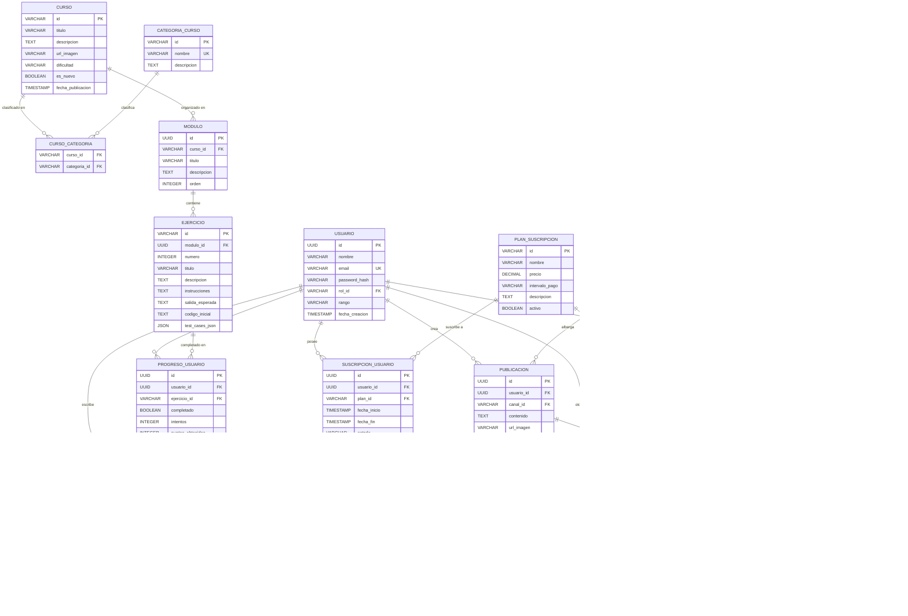

# Diseño de Base de Datos - LudiChile_1

Este documento describe el diseño propuesto para la base de datos de la aplicación LudiChile_1, basado en el análisis funcional de sus componentes.

## Diagrama Entidad-Relación (Mermaid)

## Resumen de Entidades (Detalles Adicionales)

*   **USUARIO**: `id` es UUID. `email` es único. `rol_id` referencia a `ROL`.
*   **ROL**: `id` es VARCHAR (ej: 'student', 'admin'). `descripcion` es opcional.
*   **PERMISO**: `id` es VARCHAR (ej: 'EDITAR_CURSO'). `descripcion` es opcional.
*   **ROL_PERMISO**: Tabla de unión (muchos-a-muchos) entre `ROL` y `PERMISO`.
*   **PLAN_SUSCRIPCION**: `id` es VARCHAR (ej: 'club_monthly'). `intervalo_pago` (VARCHAR) puede ser 'mes', 'año', 'unico'.
*   **CARACTERISTICA**: (Opcional) `id` y `clave` son VARCHAR.
*   **PLAN_CARACTERISTICA**: (Opcional) Tabla de unión (muchos-a-muchos) entre `PLAN_SUSCRIPCION` y `CARACTERISTICA`.
*   **SUSCRIPCION_USUARIO**: `id` y `usuario_id` son UUID. `plan_id` referencia a `PLAN_SUSCRIPCION`. `fecha_fin` y `id_transaccion_pago` son opcionales. `estado` (VARCHAR) puede ser 'activa', 'cancelada', 'expirada'.
*   **CURSO**: `id` es VARCHAR (slug, ej: 'python').
*   **CATEGORIA_CURSO**: `id` es VARCHAR (slug, ej: 'web-dev'). `nombre` es único.
*   **CURSO_CATEGORIA**: Tabla de unión (muchos-a-muchos) entre `CURSO` y `CATEGORIA_CURSO`.
*   **MODULO**: `id` es UUID. `curso_id` referencia a `CURSO`. `descripcion` es opcional. `orden` define la secuencia.
*   **EJERCICIO**: `id` es VARCHAR (slug, ej: '01-hello-world'). `modulo_id` es UUID y referencia a `MODULO`. `codigo_inicial` es opcional. `test_cases_json` almacena los casos de prueba.
*   **PROGRESO_USUARIO**: `id` y `usuario_id` son UUID. `ejercicio_id` referencia a `EJERCICIO`.
*   **CANAL**: `id` es VARCHAR (slug, ej: 'general'). `nombre` es único. `descripcion` es opcional.
*   **PUBLICACION**: `id` y `usuario_id` son UUID. `canal_id` referencia a `CANAL`. `url_imagen` es opcional.
*   **COMENTARIO**: `id`, `publicacion_id`, `usuario_id` son UUID. `comentario_padre_id` (UUID) es opcional y referencia a `COMENTARIO` (self-reference) para anidamiento.
*   **LIKE_PUBLICACION**: Tabla de unión (muchos-a-muchos) entre `USUARIO` y `PUBLICACION`. `usuario_id` y `publicacion_id` son UUID.
*   **EVENTO**: `id` es UUID. `descripcion` y `url_enlace` son opcionales.
*   **NOTICIA**: `id` es UUID. `resumen` es opcional. `tipo` (VARCHAR) indica si es 'Blog', 'Video', etc.